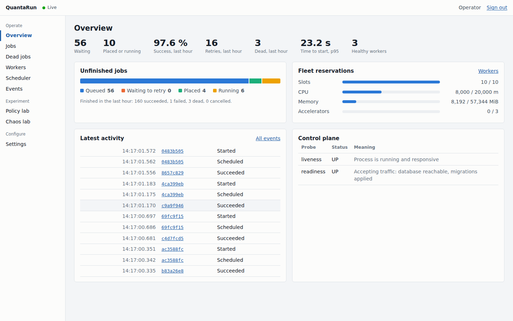
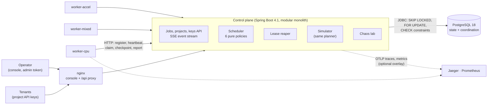
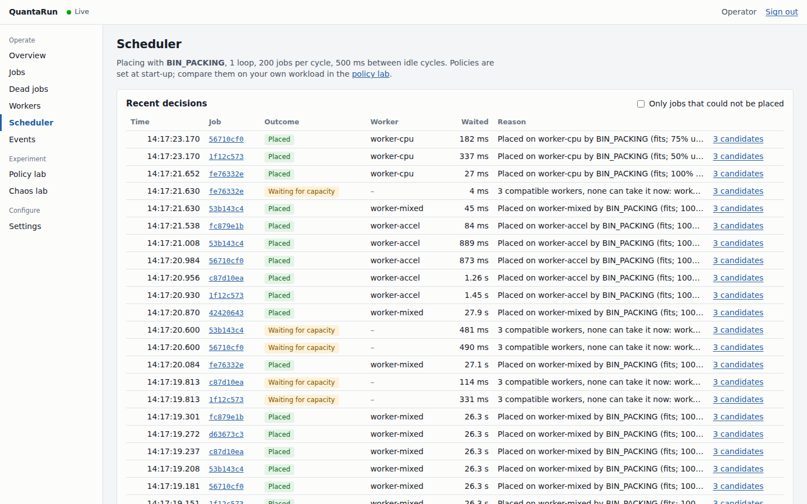
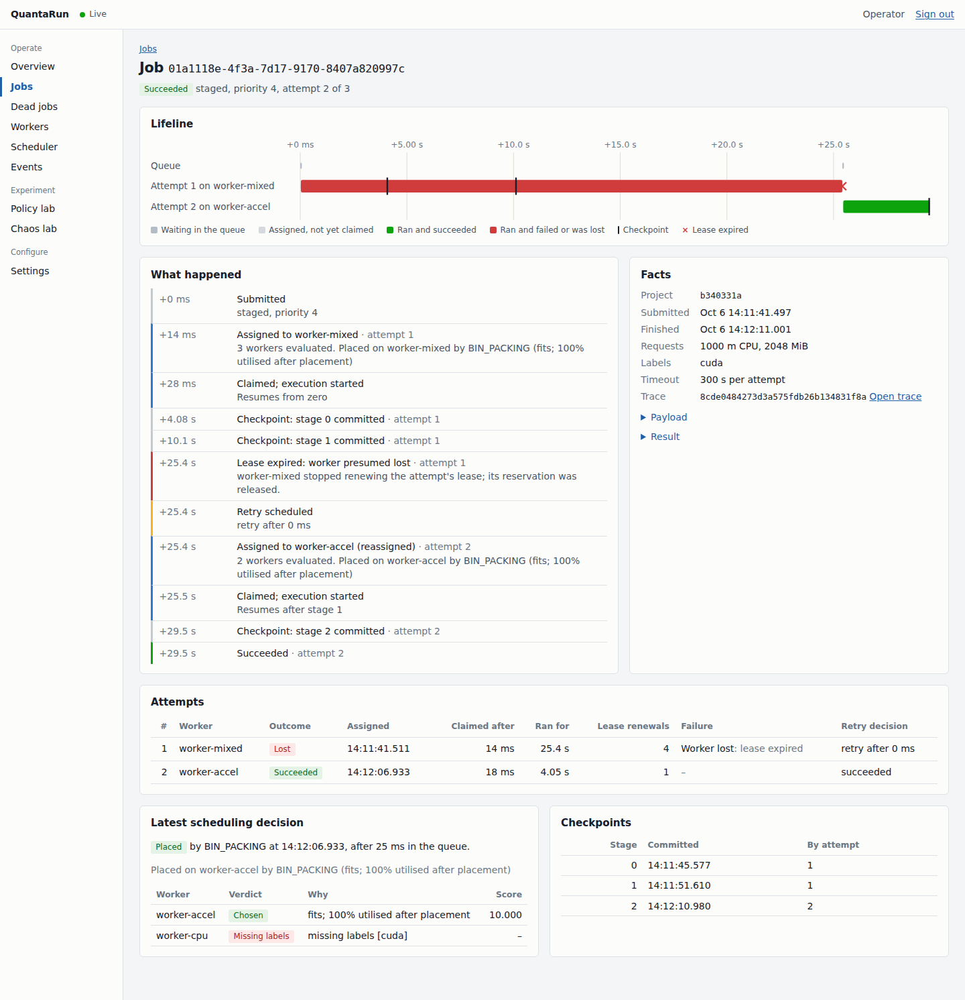
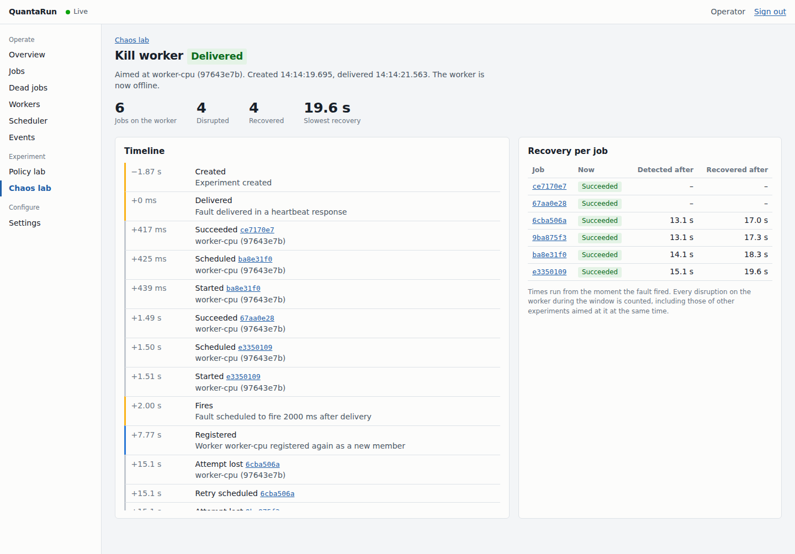
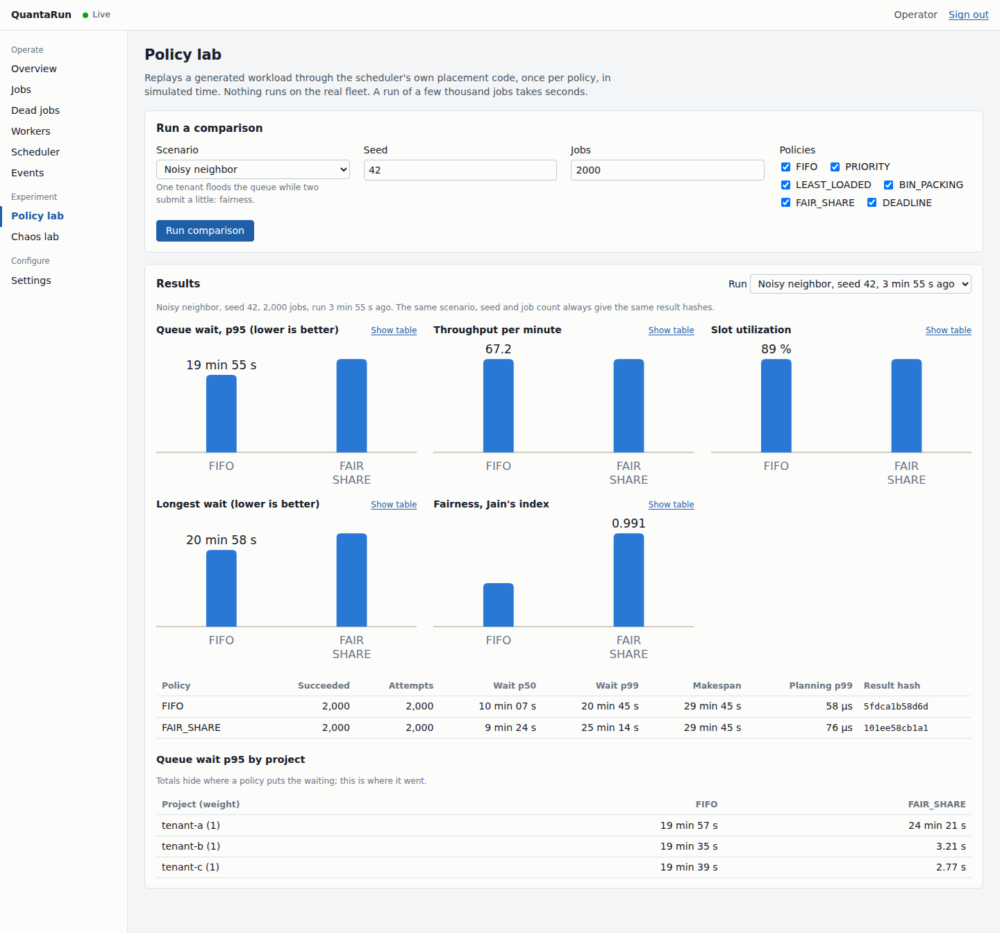

# QuantaRun

[](https://github.com/martiaaguilera/quantarun/actions/workflows/ci.yml)

[](LICENSE)

A control plane for scheduling, executing, recovering, replaying and stress-testing AI workloads on a fleet of
heterogeneous workers. PostgreSQL coordinates everything; OpenTelemetry shows what happened. It runs locally with
Docker Compose, at zero cost, with no API keys.



## Overview

Projects submit jobs: an inference call, a batch step, a multi-stage pipeline. Workers advertise CPU, memory,
simulated accelerators and labels. The scheduler places each job on a worker that fits, under one of six policies,
and records why every other worker was passed over. Workers hold each job under a lease. When a worker dies, its
lease runs out, its reservation is released and the job runs again elsewhere, resuming from its last checkpoint if
it has one. The same scheduler code can replay a workload in simulated time, so policies can be compared on the
same input before one is chosen.

**Why it exists.** Distributed job systems mostly fail in the gaps: a worker that dies holding work, a report that
arrives after its lease ran out, two schedulers placing onto the last free slot, a retry storm, one tenant flooding
the queue. QuantaRun is built around those gaps. Each guarantee is enforced by the database and proven by a test
that tries to break it on real PostgreSQL.

**What it is not.** It does not run arbitrary code: workloads are built-in executors chosen by name (`delay`,
`cpu-hash`, `mock-inference`, `fail`, `memory`, `staged`, `http`), and the inference workload is a local mock. It is
not a replacement for Kubernetes, Ray or Temporal. It is a deliberately small system that does a few hard things
correctly and shows its work.

## Engineering highlights

- **Correctness enforced by PostgreSQL, not by JVM memory.** Every state change is a conditional write whose
  affected-row count is the result. CHECK constraints make overcommitting a worker or exceeding a retry budget
  impossible to commit. 22 invariants each name the test that proves them ([INVARIANTS.md](docs/INVARIANTS.md)).
- **Lease-based recovery with fencing.** A killed worker's jobs finish elsewhere; a stale worker's late report is
  refused. Live: a worker killed mid-job was detected 13.6 s later, and the job was re-placed 25 ms after that and
  resumed after its last checkpoint ([DEMO.md](docs/DEMO.md)).
- **A torture test that runs every actor at once.** Concurrent schedulers on random policies, crashing and
  misbehaving workers, the lease reaper, cancellation, revive and duplicate submissions run together, with an
  auditor checking the invariants in every snapshot. It found a real bug in the lease fence. The race suites have
  passed 55 of 55 repeated runs since the tests' last fix ([INVARIANTS.md](docs/INVARIANTS.md)).
- **Explained, resource-aware placement.** Every decision records each candidate worker's verdict ("missing labels
  [cuda]", "needs a slot, 0 free") and score.
- **Deterministic replay.** The simulator runs the production placement code in simulated time. The same scenario,
  seed and policy give an identical SHA-256 result hash.
- **Measured, not claimed.** Profiling found three polling waits and lock contention. Fixing them took a lightly
  loaded job from 526 ms to 11 ms (p50) between submission and start, and a 1,000-job burst from 15.3 to 71.7 jobs/s
  ([BENCHMARKS.md](docs/BENCHMARKS.md)).

## Architecture



- **Control plane** (Java 25, Spring Boot 4.1): a modular monolith whose module boundaries Spring Modulith verifies.
  It uses explicit SQL through `JdbcClient`, with no ORM. It makes no outbound network calls. Several instances can
  share one database; that was run live with two.
- **Workers**: separate processes with no database access (ADR-0005). They register with a bootstrap token, receive
  a per-worker credential, heartbeat every 3 s, and long-poll for assignments.
- **PostgreSQL** is the system of record and the coordinator: `FOR UPDATE` on worker rows in id order, `SKIP LOCKED`
  for work windows, partial unique indexes and CHECK constraints as the last line of defence
  ([ADR-0001](docs/adr/0001-postgresql-as-coordinator.md)).
- **Console** (React 19, TypeScript strict): a dense operations UI on real data, updated live over Server-Sent
  Events.

More in [ARCHITECTURE.md](docs/ARCHITECTURE.md) and the [ADRs](docs/adr).

## Reliability model

- **Attempts are assignments.** A job runs as attempt 1, 2, …; each attempt holds the worker reservation and a
  lease. Attempts are never overwritten.
- **Leases and fencing.** A worker renews its leases with each heartbeat. Claim, report and checkpoint are fenced by
  attempt id, worker id and an unexpired lease. After expiry, only the reaper may act on the attempt, so completion
  racing expiry has exactly one winner ([ADR-0002](docs/adr/0002-leases-and-fencing.md)).
- **Execution is at least once; completion is exactly once.** A presumed-dead worker that is only slow may finish
  its copy, but its report is refused with `409 LEASE_EXPIRED`.
- **Idempotent submission.** The same `Idempotency-Key` and body always give the same job, even with 500 duplicates
  sent concurrently. The same key with a different body is `409`.
- **Bounded retries.** Each job has 1–10 attempts, with exponential full-jitter backoff that honours Retry-After. A
  dead job can be revived with a fresh budget, at most 10 times.

The full semantics are in [SPEC.md](docs/SPEC.md); what each failure looks like is in
[FAILURE_SEMANTICS.md](docs/FAILURE_SEMANTICS.md).

## Scheduling



Six policies, all pure functions over a snapshot of the fleet and the queue:

| Policy | Orders work by | Trade-off |
|---|---|---|
| `FIFO` | arrival | Simple and predictable; a flood delays everyone |
| `PRIORITY` | priority, then arrival | Strict: a steady stream of urgent work starves the rest |
| `LEAST_LOADED` | arrival, onto the emptiest worker | Spreads load; fragments capacity, so a big job may find no single worker with room |
| `BIN_PACKING` | arrival, onto the fullest worker that fits, keeping accelerator workers for jobs that need them | Leaves whole workers free for big or accelerator jobs; concentrates load and failure blast radius |
| `FAIR_SHARE` | weighted virtual time per project | A flooding tenant cannot starve the others; priority is ignored across projects |
| `DEADLINE` | earliest deadline first | Fewest misses while the fleet keeps up; degrades badly under overload |

Per-project quotas cap queued jobs (at admission, `429`), running jobs and accelerators (at placement, with a stated
reason). Policies and their measured behaviour are in [SCHEDULER.md](docs/SCHEDULER.md).

## Failure recovery



| Failure | What happens |
|---|---|
| Worker killed (`SIGKILL`, OOM, host loss) | Lease expires (15 s); attempt LOST; reservation released; job retried at once elsewhere; staged jobs resume after the last checkpoint |
| Worker paused or partitioned | Same; its late reports and heartbeats are refused, and it re-registers as a new member |
| Worker never claims what it was given | The assignment is released after the claim timeout plus one lease |
| Workload fails | Classified (transient, rate-limited, timeout, invalid input, …); retried with backoff or ended per class |
| PostgreSQL restarts | API answers `503` within 3 s; workers hold their reports; leases are extended for the time nobody could hear them, so the outage costs no work |
| Control plane restarts | Same: leases are extended and retirement paused before anything is judged |

Eight predefined faults can be injected into the workers from the chaos lab, with a recovery timeline per
experiment ([CHAOS.md](docs/CHAOS.md)).



## Policy simulation



The simulator replays a generated workload through the same planner the scheduler uses, in simulated time. It
covers eight scenarios: steady, burst, mixed resources, scarce accelerators, a noisy neighbour, deadlines, worker
failures and provider rate limits. In the noisy-neighbour scenario, two light tenants wait a median of about 530 s
under FIFO and about 1 s under FAIR_SHARE, while the flooding tenant pays 758 s instead of 624 s. A 2,000-job
comparison of three policies took 2.7 s. Results are stored, and identical for the same seed
([SIMULATION.md](docs/SIMULATION.md)).

## Observability

Every job is one OpenTelemetry trace across both processes: submission, queueing, the scheduling decision, the
worker's run, provider calls, the report, retries and lease recovery. Micrometer metrics with low-cardinality tags
are recorded only after commit, so a rolled-back placement counts nothing. Logs are structured JSON carrying
`jobId`, `attemptId`, `workerId` and the trace id. Jaeger and Prometheus come as an optional compose overlay
([OBSERVABILITY.md](docs/OBSERVABILITY.md)).

## Testing

- **417 Java tests** (325 control plane, 92 worker), **25 web unit tests** and **5 Playwright end-to-end tests** that
  drive the console of a running stack (sign-in, the fleet, a job followed to success, revive, policy replay). Everything that touches SQL, locking or
  transactions runs against real PostgreSQL 18 in Testcontainers; the database is never mocked.
- **Race tests** for every concurrency feature: 16 concurrent schedulers per policy, completion racing lease expiry,
  500 duplicate submissions, heartbeats racing the reaper, checkpoints racing recovery.
- **Property tests** over thousands of random fleets and workloads per policy: never over capacity, quotas held,
  lean and explaining plans identical.
- **`ConcurrencyTortureTest`** runs everything at once. `scripts/repeat-race-tests.sh` reruns the race suites
  ([INVARIANTS.md](docs/INVARIANTS.md) has the record).
- **Golden hashes** pin the simulator's results: 8 scenarios × 6 policies.

## Benchmarks

Measured on 2026-10-06 on a 4-vCPU cloud container, as medians of three runs. Each comes with its commit and command
in [BENCHMARKS.md](docs/BENCHMARKS.md).

| | Before tuning | After |
|---|---|---|
| Time from submission to start, 5 jobs/s, p50 | 526 ms | 11 ms |
| Same, p99 | 912 ms | 23 ms |
| 1,000-job burst on 10 slots (ceiling 100 jobs/s) | 15.3 jobs/s | 71.7 jobs/s |
| 20,000-job, six-policy simulation | 30–33 s | 11–13 s, identical hashes |
| Console overview at 1,000,000 jobs (database time) | 259–318 ms | 12–15 ms |

## Quick start

Requirements: Docker with Compose. Java 25 and Node 24 are needed only for development outside containers.

```bash
cp .env.example .env
docker compose up --build --wait
```

- Console: <http://localhost:3000>. Sign in with `QUANTARUN_ADMIN_TOKEN` from `.env`.
- API guide: [docs/API.md](docs/API.md). OpenAPI document: <http://localhost:8080/v3/api-docs>.
- Five-minute walkthrough: [docs/DEMO.md](docs/DEMO.md).
- With traces and metrics: `docker compose -f docker-compose.yml -f docker-compose.observability.yml up --build --wait`.
  Jaeger runs on <http://localhost:16686> and Prometheus on <http://localhost:9090>.
- With fault injection: set `QUANTARUN_CHAOS_ENABLED=true` in `.env`.

Development:

```bash
./mvnw verify                          # format check, compile, unit + Testcontainers tests (Docker required)
cd apps/web && npm ci && npm run check # typecheck, lint, test, build
cd apps/web && npx playwright install chromium && npm run e2e  # against the running stack
```

How to contribute, and the rules a change must follow: [CONTRIBUTING.md](CONTRIBUTING.md).

## Technology

Java 25, Spring Boot 4.1, Spring Modulith, `JdbcClient`, Flyway and PostgreSQL 18; Micrometer and OpenTelemetry;
React 19, TypeScript 6 (strict), TanStack Query and Vite 8; Testcontainers, JUnit 6, Vitest and Playwright; Docker Compose, nginx
and GitHub Actions. The reasons for each choice are in
[ADR-0006](docs/adr/0006-development-environment-and-toolchain.md).

## Design decisions

| Decision | Why | Record |
|---|---|---|
| PostgreSQL as the only coordinator | Row locks, `SKIP LOCKED` and constraints give the guarantees with one moving part; no broker to keep consistent with it | [ADR-0001](docs/adr/0001-postgresql-as-coordinator.md) |
| Leases with fencing, not heartbeats alone | Liveness is a guess; the fence makes a wrong guess harmless | [ADR-0002](docs/adr/0002-leases-and-fencing.md) |
| Explicit SQL, no ORM | Every lock, conditional write and index use is visible and reviewable | [ADR-0003](docs/adr/0003-explicit-sql-with-jdbcclient.md) |
| Pure policies shared with the simulator | Replay runs the code that schedules, not a model of it | [ADR-0004](docs/adr/0004-pure-policies-shared-with-simulator.md) |
| Workers speak HTTP, never SQL | A worker is a failure domain, not a database client; its credential grants only its own work | [ADR-0005](docs/adr/0005-workers-use-http-not-the-database.md) |
| Chaos faults pulled in heartbeats | No inbound "break yourself" endpoint to secure | [ADR-0007](docs/adr/0007-chaos-faults-pulled-in-heartbeats.md) |

What went wrong along the way, and what each fix cost, is in [ENGINEERING_LOG.md](docs/ENGINEERING_LOG.md).

## Documentation

| Document | What it answers |
|---|---|
| [SPEC.md](docs/SPEC.md) | What the system guarantees: states, semantics, phases |
| [ARCHITECTURE.md](docs/ARCHITECTURE.md) | How it is built, module by module |
| [INVARIANTS.md](docs/INVARIANTS.md) | The 22 invariants and the test that proves each |
| [SCHEDULER.md](docs/SCHEDULER.md) | The scheduling cycle, policies, fairness, quotas, query plans |
| [FAILURE_SEMANTICS.md](docs/FAILURE_SEMANTICS.md) | What every failure looks like and how it is recovered |
| [SIMULATION.md](docs/SIMULATION.md) · [CHAOS.md](docs/CHAOS.md) | Policy replay and fault injection, with measured results |
| [OBSERVABILITY.md](docs/OBSERVABILITY.md) | Traces, metrics and logs |
| [API.md](docs/API.md) | Credentials, endpoints, workloads, error codes, the worker protocol |
| [THREAT_MODEL.md](docs/THREAT_MODEL.md) · [SECURITY.md](SECURITY.md) | Threats, mitigations, residual risks, reporting |
| [BENCHMARKS.md](docs/BENCHMARKS.md) | Measurements with date, commit, hardware and command |
| [ENGINEERING_LOG.md](docs/ENGINEERING_LOG.md) | What went wrong and what each fix cost |
| [FINAL_REVIEW.md](docs/FINAL_REVIEW.md) | The release review and its open findings |
| [DEMO.md](docs/DEMO.md) · [INTERVIEW_GUIDE.md](docs/INTERVIEW_GUIDE.md) · [PORTFOLIO.md](docs/PORTFOLIO.md) | Walkthrough and talking points |
| [docs/adr](docs/adr) | Architecture decisions |

## Known limitations

- **One PostgreSQL primary bounds scale.** Several control planes can share it, but every placement takes worker row
  locks there. Throughput was measured on one machine with ten slots, not on a large fleet.
- **History is never deleted.** Jobs, attempts, events and decisions grow without bound. Hot queries read only live
  rows or recent windows, but there is no retention job.
- **Execution is at least once.** A worker that is slow rather than dead can run a job that is also retried. Only one
  completion is recorded, but side effects of an external call could happen twice.
- **Workloads are built in.** There is no way to run your own code, by design. Accelerators are simulated slots, and
  the inference provider is a local mock.
- **No TLS and no rate limiting** in the local stack. Every port binds to `127.0.0.1`.
  [THREAT_MODEL.md](docs/THREAT_MODEL.md) lists the residual risks.
- **Some limits are per control-plane instance**, such as concurrent simulations and event streams.

The final review lists every open finding: [FINAL_REVIEW.md](docs/FINAL_REVIEW.md). To report a security issue, see
[SECURITY.md](SECURITY.md).

## Author

Martí Aguilera · [GitHub](https://github.com/martiaaguilera) · [LinkedIn](https://www.linkedin.com/in/martiaaguilera/)

Licensed under the [MIT License](LICENSE).
