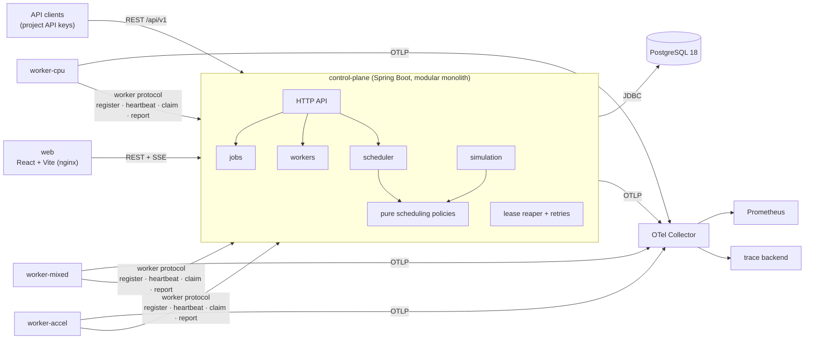

# QuantaRun architecture

The semantics are defined in `SPEC.md`. This document explains how they are enforced.

## 1. Deployables



| Component | Responsibility | Why it is separate |
|---|---|---|
| `apps/control-plane` | Owns all state: API, admission, scheduling, leases, retries, simulation, SSE | One process; modules instead of services (ADR-0001) |
| `apps/worker` | Registers capacity, heartbeats, claims attempts, runs built-in executors, reports results | Has its own failure domain, so killing it is the demo. It has **no database access** (ADR-0005) |
| `apps/worker-protocol` | Java records for the worker ↔ control-plane HTTP contract | One definition of the wire format, used by both sides |
| `apps/web` | Operations console | Static build served by nginx, which proxies `/api` |
| PostgreSQL | System of record and coordination (locks, constraints) | ADR-0001 |

Several control-plane instances may run against one database. Every coordination step goes through
PostgreSQL row locks and conditional writes, never through JVM memory. The demo runs one instance,
while the tests run several concurrent schedulers.

## 2. Control-plane modules

Packages under `io.github.martiaaguilera.quantarun`, verified by Spring Modulith (`ApplicationModules.verify()`):

| Module | Owns |
|---|---|
| `projects` | projects, API keys, quotas |
| `jobs` | job submission, idempotency, the state machine (`JobStatus`), attempts, events, checkpoints |
| `workers` | registration, heartbeats, health, draining, capacity rows |
| `execution` | the worker protocol's claim, heartbeat (with lease renewal) and report endpoints; separate because it needs both `workers` and `jobs`, and `jobs` already depends on `workers` |
| `scheduler` | the scheduling loop, the snapshot loader, decision records |
| `scheduler.policy` | **pure** policies (no Spring, no SQL); shared with `simulation` |
| `reliability` | the lease reaper (retry decisions live with the attempt-ending transaction in `jobs`) |
| `simulation` | scenarios, trace generation, the discrete-event engine, metrics |
| `console` | read models for the console that span modules: the overview (jobs and fleet) and the effective settings |
| `chaos` | the fault catalogue, experiments, their delivery to workers in heartbeat responses, and recovery timelines |
| `web` | cross-cutting HTTP concerns: Problem Details, security filter, SSE |

Allowed dependencies point inward: `scheduler → jobs, workers, projects`; `execution → jobs, workers, chaos`; `chaos → jobs, workers`; `console → jobs, workers, scheduler, chaos, security`; `reliability → jobs`; `jobs → workers`;
`simulation → scheduler::policy` (a named interface) and `jobs` (only the pure `RetryPolicy`). The policies depend on nothing except their own snapshot records.

## 3. Persistence

Explicit SQL through Spring `JdbcClient` (ADR-0003). There is no JPA and no generated schema. Flyway owns
all DDL. The core tables (the authoritative definitions are the migrations under
`apps/control-plane/src/main/resources/db/migration`) are:

| Table | Key columns / constraints |
|---|---|
| `projects` | `weight > 0`, quotas |
| `api_keys` | `prefix` unique, `hash`, `revoked_at` |
| `jobs` | `status` (CHECK in enum), `priority`, `available_at`, `deadline_at`, requirements as columns, `payload jsonb`, `max_attempts`, `attempt_count`, `cancel_requested_at`, `trace_parent` (W3C, CHECK), `unique(project_id, idempotency_key)` |
| `job_attempts` | `job_id`, `attempt_no`, `worker_id`, `status`, reservation columns, `lease_expires_at`, `failure_class`, `retry_decision`, `trace_parent` (the placement span); **partial unique index: one active attempt per job**; `unique(job_id, attempt_no)` |
| `workers` | capacity + `reserved_*` columns with `CHECK (0 <= reserved <= capacity)`, `lifecycle`, labels |
| `worker_heartbeats` | `worker_id`, `last_seen_at`. **Split from `workers` on purpose** (see §4) |
| `job_checkpoints` | `unique(job_id, stage_index)` |
| `job_events` | append-only timeline |
| `scheduler_decisions` | policy, outcome, chosen worker, bounded `candidates jsonb` |
| `simulation_runs` | scenario, seed, `job_count` (CHECK 1–20,000), requesting project, `results jsonb` |
| `chaos_experiments` | `fault` and `status` (CHECK in enum), target worker (and job), bounded parameter columns (CHECKs), `deliver_by`; partial index on pending experiments per worker |

JSONB is used only for workload payloads, checkpoint results, event details, decision candidate lists and stored
simulation results.
Every field the scheduler filters or sorts on is a real column.

## 4. Concurrency model

The rules that every write path follows:
1. **Conditional writes.** State changes are `UPDATE ... WHERE id = ? AND status = ?`, and the affected-row
   count decides the outcome. Losing a race is a normal, typed result, not an exception to swallow.
2. **Constraints as the last line of defence.** Capacity CHECKs, the one-active-attempt partial unique
   index and the idempotency unique key make the database reject invariant violations even if the Java
   logic is wrong.
3. **Short transactions, no I/O inside.** No HTTP call, workload execution or sleep ever happens while a
   transaction is open.
4. **Consistent lock order.** A transaction that locks both jobs and workers locks jobs first, then workers
   in ascending id order, which prevents deadlocks between schedulers, reapers and completions.
5. **Leases measure the workers' silence, not the control plane's.** Before any lease is judged (the reaper's tick,
   and every heartbeat, claim, report and checkpoint), `LeaseContinuity` checks when the database was last reached.
   If that is longer ago than two heartbeat intervals, or never since start, it first extends every active lease in
   its own transaction. Liveness retirement pauses for a grace after the same kind of gap (I22). When the database is
   unreachable, the pool gives up after 3 s and the API answers `503 DATABASE_UNAVAILABLE` with Retry-After, which
   workers retry without spending their report budget.

Transaction semantics per operation:

| Operation | Transaction | Why it is correct under concurrency |
|---|---|---|
| **Submit** | If the project has an admission quota: lock its row, replay an existing idempotent submission, count unfinished jobs and reject at the quota. Then `INSERT jobs ... ON CONFLICT (project_id, idempotency_key) DO NOTHING RETURNING id`; if no row came back, read the existing row in a new statement and compare the request hash | Concurrent duplicates serialize on the unique index; exactly one insert wins |
| **Schedule cycle** | Lock a window of runnable jobs (`FOR UPDATE SKIP LOCKED`; round-robin over projects for FAIR_SHARE), lock ACTIVE+HEALTHY workers (`FOR UPDATE`, id order), read quota usage and virtual times, run the pure policy, persist virtual times, insert attempts, add to `reserved_*`, set jobs to SCHEDULED, insert decisions and events | Other schedulers skip locked jobs rather than queue behind them; worker row locks serialize reservations; the CHECK constraints reject any overcommit |
| **Claim** | `UPDATE job_attempts SET status='RUNNING' WHERE id=? AND worker_id=? AND status='ASSIGNED'`, plus the job `SCHEDULED → RUNNING` | Fenced by attempt id + worker id; a stale or duplicate claim changes 0 rows |
| **Heartbeat / lease renewal** | Update `worker_heartbeats`; then lock the worker's renewable attempts `ORDER BY id FOR UPDATE` (ASSIGNED ones, plus the RUNNING ones the worker reports, all with `lease_expires_at > now()`) and push their leases forward | Never revives an already-expired lease (the predicate is re-checked after a lock wait); renewal and reaper exclude each other through the row lock on the attempt; the id order keeps overlapping heartbeats from deadlocking (ENGINEERING_LOG) |
| **Report outcome** | Lock the attempt row, verify it is active, owned by the worker and its lease still held, finish it, release the reservation on the worker row, apply the job transition or retry decision, and append an event | Completion and lease expiry both need the attempt row lock, so exactly one wins; the loser sees a non-active attempt and gets `409`. A repeated identical report returns the recorded outcome |
| **Lease reaper** | `SELECT ... FROM job_attempts WHERE status IN (ASSIGNED,RUNNING) AND lease_expires_at < now() ORDER BY lease_expires_at FOR UPDATE SKIP LOCKED LIMIT n`, re-sorted by worker id, then the same finish path with `WORKER_LOST`. Runs every second, only after active leases were extended at startup | The same code path as a failure report, so there is one release implementation. Several reapers can run safely; worker-id order keeps their worker locks in the global order. The startup extension means control-plane downtime never counts against workers |
| **Checkpoint** | Lock the attempt row, verify it is RUNNING, owned by the worker and its lease still held, check the stage is the last committed one plus one, insert the stage and an event | The attempt row lock serialises it against the reaper and against duplicates; only one attempt per job is active (I3), and `PRIMARY KEY (job_id, stage_index)` is the last guard (I14) |
| **Revive** | `UPDATE jobs SET status='QUEUED', budget_start=attempt_count, revive_count=revive_count+1, ... WHERE id=? AND status='DEAD' AND revive_count < 10` | One conditional statement: of concurrent revives exactly one matches; the budget CHECK is stated per budget (I9, I13) |
| **Cancel** | Queued/retry-wait jobs: a conditional update to CANCELLED. Active jobs: set `cancel_requested_at`; the worker is told in its heartbeat response | Scheduling reads only QUEUED/RETRY_WAIT rows under lock, so a concurrently cancelled job cannot be placed |

**Why heartbeats have their own table.** The scheduler locks worker rows `FOR UPDATE` while reserving
capacity. In PostgreSQL, any `UPDATE` of the same row conflicts with that lock. If `last_seen_at` lived on
`workers`, every heartbeat would block behind scheduling cycles (and the other way round). Keeping
heartbeats in a separate row removes that hot-row contention.

## 5. Worker protocol

Workers speak JSON over HTTP under `/worker-api/v1`, a namespace separate from the client API so the two credential
families can never overlap (see ENGINEERING_LOG). Registration presents the shared bootstrap token and receives a
**per-worker credential** (`qw_...`, stored as a SHA-256 hash). Every later call uses that credential, and the control
plane acts on the authenticated worker id, never a client-supplied one.
1. `POST register`: capacity, labels and version. Returns the worker id, its credential and the timing configuration.
2. `POST heartbeat` every 3 s, carrying the ids of the worker's active attempts. The response contains
   cancel requests and leases that are no longer valid, which the worker must stop immediately, and any chaos faults
   aimed at this worker (ADR-0007, CHAOS.md). Heartbeats renew the leases of running attempts the worker lists, and of
   unclaimed assignments for at most `claim-timeout` (30 s), so a worker whose intake is stuck cannot hold work.
3. `POST deregister`: on graceful shutdown. Leaves immediately with nothing reserved, otherwise drains first.
4. `POST claim`: returns up to `maxAssignments` ASSIGNED attempts of this worker with their payloads and trace
   context, and starts them (RUNNING). The worker polls it every 500 ms while it has free slots, and at once after a claim that returned work.
   Long polling was not needed at this scale.
5. `POST attempts/{id}/checkpoints` and `POST attempts/{id}/report`: fenced by attempt id + worker id. A claim
   hands over the job's last committed checkpoint, so a retry of a staged workload resumes after it.

Liveness: health (HEALTHY → LATE → OFFLINE) is derived from heartbeat age against the database clock. The liveness
monitor retires silent registrations, but never during the startup grace period after a control-plane restart.
A retired registration is never revived; the process registers again under a new id.

Delivery is **at-least-once execution, at-most-once committed success**. A worker that was partitioned may
still finish work after its lease was reclaimed, but its report is rejected. Built-in workloads that cause
external side effects (`http`) must therefore be idempotent or explicitly accept duplicates; this is
documented in `FAILURE_SEMANTICS.md`.

## 6. Scheduling pipeline

```mermaid
sequenceDiagram
    participant S as Scheduler loop
    participant DB as PostgreSQL
    participant P as Policy (pure)
    S->>DB: BEGIN; lock runnable job window (SKIP LOCKED)
    S->>DB: lock eligible workers (FOR UPDATE, id order)
    S->>P: decide(snapshot)
    P-->>S: placements + explanations
    S->>DB: insert attempts, reserve capacity, SCHEDULED, decisions, events
    S->>DB: COMMIT
```

Decision records are written when a job is placed, or when its outcome or reason *changes*. A job that
stays unschedulable for an hour produces one record, not one per cycle.

## 7. Simulation

The simulator runs `PlacementPlanner` and `RetryPolicy`, the production decision code, on in-memory state. A priority
queue of timestamped events drives it (arrival, attempt finished, retry ready, worker down and up, lease expired), and
it selects each cycle's window the way the live cycle does. Randomness comes from one seeded `SplittableRandom` per
scenario. There is no wall clock and no threads, so results are reproducible (I15), and a 2,000-job scenario runs
against all six policies in under 6 s. What simulation does **not** model (DB latency, lock contention, heartbeats) is
measured separately in benchmarks. Details and measured results are in `SIMULATION.md`.

## 8. Observability

Details, the metric catalogue and measured examples are in `OBSERVABILITY.md`; backends in ADR-0008.

- **Traces:** Micrometer Tracing with the OpenTelemetry bridge, exported over OTLP when an endpoint is configured
  (`docker-compose.observability.yml` points it at Jaeger). A job is one trace. The submission's W3C context is stored
  with the job; placement adds `job.queued` and `job.schedule` spans to that trace after its transaction commits. The
  claim hands the decision's context to the worker, whose `attempt.run`, provider calls and report join the trace.
  Polling (heartbeat, claim), actuator requests and scheduled housekeeping are not observed.
- **Metrics:** Micrometer to Prometheus, with low-cardinality tags only (`workload_type`, `status`, `outcome`,
  `failure_class`, `decision`, `policy`, `resource`). Counters and timers about state changes are recorded after
  commit; queue and fleet gauges are refreshed on a schedule.
- **Logs:** Boot structured JSON (ECS) with `traceId`/`spanId`, and `jobId`, `attemptId`, `workerId`, `projectId` as
  fields.

## 9. Operations console

`apps/web` is a React 19 single-page app built by Vite and served by nginx, which proxies `/api`. It holds no state of
its own beyond the credential (in `sessionStorage`, so it dies with the tab) and the trace-viewer URL template.

- **Data:** TanStack Query over the REST API. Errors are Problem Details shown with the server's `detail`; a 401
  signs the console out.
- **Live updates:** `GET /api/v1/events/stream`. `EventSource` cannot send an `Authorization` header, so the client
  reads the stream with `fetch` and parses it, reconnecting with jittered exponential backoff and `Last-Event-ID`.
  Events do not patch cached data: they invalidate the affected queries (at most once a second), so the screen is
  always what the API says.
- **The stream on the server:** `JobEventStream` tails `job_events` by id. Identity ids are assigned at insert, not at
  commit, so a lower id can become visible after a higher one. The tailer keeps a low watermark below which every id
  has been either delivered or given up on: an id missing above the watermark is waited for up to
  `quantarun.events.gap-timeout` (5 s) before it is treated as rolled back. Each subscriber has a bounded queue drained
  by its own virtual thread; one that falls behind is disconnected, and resumes with `Last-Event-ID` (a replay of up
  to 1,000 events, or a `reset` that tells the client to refetch).
- **Job story:** the job page merges events, attempts, decisions and checkpoints into one ordered narrative and a
  lifeline (one lane for the queue, one per attempt), so a retry or a lost lease reads as what happened, not as rows.

## 10. Development environment

The code is developed on the Windows host, with Docker Desktop on WSL2 running PostgreSQL, the
Testcontainers databases and the compose stack (ADR-0006). CI runs on Linux, so Linux behaviour is
verified on every push.
