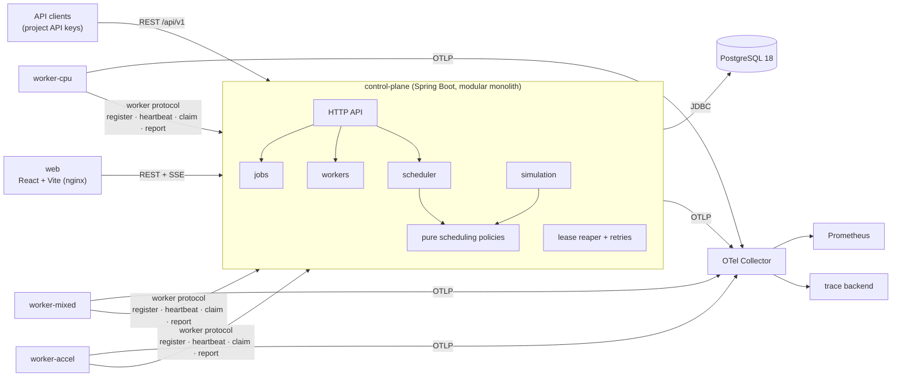

# QuantaRun architecture

The semantics are defined in `SPEC.md`. This document explains how they are enforced.

## 1. Deployables



| Component | Responsibility | Why it is separate |
|---|---|---|
| `apps/control-plane` | Owns all state: API, admission, scheduling, leases, retries, simulation, SSE | One process; modules instead of services (ADR-0001) |
| `apps/worker` | Registers capacity, heartbeats, claims attempts, runs built-in executors, reports results | Has its own failure domain, so killing it is the demo. It has **no database access** (ADR-0005) |
| `apps/worker-protocol` | Java records for the worker ↔ control-plane HTTP contract | One definition of the wire format, used by both sides |
| `apps/web` | Operations console | Static build served by nginx, which proxies `/api` |
| PostgreSQL | System of record and coordination (locks, constraints) | ADR-0001 |

Several control-plane instances may run against one database. Every coordination step goes through
PostgreSQL row locks and conditional writes, never through JVM memory. The demo runs one instance,
while the tests run several concurrent schedulers.

## 2. Control-plane modules

Packages under `io.github.martiaaguilera.quantarun`, verified by Spring Modulith (`ApplicationModules.verify()`):

| Module | Owns |
|---|---|
| `projects` | projects, API keys, quotas |
| `jobs` | job submission, idempotency, the state machine (`JobStatus`), attempts, events, checkpoints |
| `workers` | registration, heartbeats, health, draining, capacity rows |
| `scheduler` | the scheduling loop, the snapshot loader, decision records |
| `scheduler.policy` | **pure** policies (no Spring, no SQL); shared with `simulation` |
| `reliability` | the lease reaper, retry/backoff decisions, failure classification |
| `simulation` | scenarios, trace generation, the discrete-event engine, metrics |
| `chaos` | predefined fault scenarios targeting QuantaRun's own workers |
| `web` | cross-cutting HTTP concerns: Problem Details, security filter, SSE |

Allowed dependencies point inward: `scheduler → jobs, workers, projects`; `reliability → jobs, workers`;
`simulation → scheduler.policy` only. The policies depend on nothing except their own snapshot records.

## 3. Persistence

Explicit SQL through Spring `JdbcClient` (ADR-0003). There is no JPA and no generated schema. Flyway owns
all DDL. The core tables (the authoritative definitions are the migrations under
`apps/control-plane/src/main/resources/db/migration`) are:

| Table | Key columns / constraints |
|---|---|
| `projects` | `weight > 0`, quotas |
| `api_keys` | `prefix` unique, `hash`, `revoked_at` |
| `jobs` | `status` (CHECK in enum), `priority`, `available_at`, `deadline_at`, requirements as columns, `payload jsonb`, `max_attempts`, `attempt_count`, `cancel_requested_at`, `unique(project_id, idempotency_key)` |
| `job_attempts` | `job_id`, `attempt_no`, `worker_id`, `status`, reservation columns, `lease_expires_at`, `failure_class`, `retry_decision`, `trace_id`; **partial unique index: one active attempt per job**; `unique(job_id, attempt_no)` |
| `workers` | capacity + `reserved_*` columns with `CHECK (0 <= reserved <= capacity)`, `lifecycle`, labels |
| `worker_heartbeats` | `worker_id`, `last_seen_at`. **Split from `workers` on purpose** (see §4) |
| `job_checkpoints` | `unique(job_id, stage_index)` |
| `job_events` | append-only timeline |
| `scheduler_decisions` | policy, outcome, chosen worker, bounded `candidates jsonb` |

JSONB is used only for workload payloads, checkpoint results, event details and decision candidate lists.
Every field the scheduler filters or sorts on is a real column.

## 4. Concurrency model

The rules that every write path follows:
1. **Conditional writes.** State changes are `UPDATE ... WHERE id = ? AND status = ?`, and the affected-row
   count decides the outcome. Losing a race is a normal, typed result, not an exception to swallow.
2. **Constraints as the last line of defence.** Capacity CHECKs, the one-active-attempt partial unique
   index and the idempotency unique key make the database reject invariant violations even if the Java
   logic is wrong.
3. **Short transactions, no I/O inside.** No HTTP call, workload execution or sleep ever happens while a
   transaction is open.
4. **Consistent lock order.** A transaction that locks both jobs and workers locks jobs first, then workers
   in ascending id order, which prevents deadlocks between schedulers, reapers and completions.

Transaction semantics per operation:

| Operation | Transaction | Why it is correct under concurrency |
|---|---|---|
| **Submit** | `INSERT jobs ... ON CONFLICT (project_id, idempotency_key) DO NOTHING RETURNING id`; if no row came back, read the existing row in a new statement and compare the request hash | Concurrent duplicates serialize on the unique index; exactly one insert wins |
| **Schedule cycle** | Lock a window of runnable jobs (`FOR UPDATE SKIP LOCKED`), lock ACTIVE+HEALTHY workers (`FOR UPDATE`, id order), run the pure policy, insert attempts, add to `reserved_*`, set jobs to SCHEDULED, insert decisions and events | Other schedulers skip locked jobs rather than queue behind them; worker row locks serialize reservations; the CHECK constraints reject any overcommit |
| **Claim** | `UPDATE job_attempts SET status='RUNNING' WHERE id=? AND worker_id=? AND status='ASSIGNED'`, plus the job `SCHEDULED → RUNNING` | Fenced by attempt id + worker id; a stale or duplicate claim changes 0 rows |
| **Heartbeat / lease renewal** | Upsert `worker_heartbeats`; `UPDATE job_attempts SET lease_expires_at = now()+lease WHERE worker_id=? AND status IN (ASSIGNED,RUNNING) AND lease_expires_at > now()` | Never revives an already-expired lease; renewal and reaper exclude each other through the row lock on the attempt |
| **Report outcome** | Lock the attempt row, verify it is active and owned by the worker, finish it, release the reservation on the worker row, apply the job transition or retry decision, and append an event | Completion and lease expiry both need the attempt row lock, so exactly one wins; the loser sees a non-active attempt and gets `409`. A repeated identical report returns the recorded outcome |
| **Lease reaper** | `SELECT ... FROM job_attempts WHERE status IN (ASSIGNED,RUNNING) AND lease_expires_at < now() FOR UPDATE SKIP LOCKED LIMIT n`, then the same finish path with `WORKER_LOST` | The same code path as a failure report, so there is one release implementation. Several reapers can run safely |
| **Cancel** | Queued/retry-wait jobs: a conditional update to CANCELLED. Active jobs: set `cancel_requested_at`; the worker is told in its heartbeat response | Scheduling reads only QUEUED/RETRY_WAIT rows under lock, so a concurrently cancelled job cannot be placed |

**Why heartbeats have their own table.** The scheduler locks worker rows `FOR UPDATE` while reserving
capacity. In PostgreSQL, any `UPDATE` of the same row conflicts with that lock. If `last_seen_at` lived on
`workers`, every heartbeat would block behind scheduling cycles (and the other way round). Keeping
heartbeats in a separate row removes that hot-row contention.

## 5. Worker protocol

Workers authenticate with a worker token and speak JSON over HTTP:
1. `POST register`: capacity, labels and version. Returns the worker id and timing configuration.
2. `POST heartbeat` every 3 s, carrying the ids of the worker's active attempts. The response contains
   cancel requests and leases that are no longer valid, which the worker must stop immediately.
3. `POST claim`: long-polls for ASSIGNED attempts on this worker and returns the payload plus the last
   checkpoint.
4. `POST attempts/{id}/checkpoints` and `POST attempts/{id}/report`: fenced by attempt id + worker id.

Delivery is **at-least-once execution, at-most-once committed success**. A worker that was partitioned may
still finish work after its lease was reclaimed, but its report is rejected. Built-in workloads that cause
external side effects (`http`) must therefore be idempotent or explicitly accept duplicates; this is
documented in `FAILURE_SEMANTICS.md`.

## 6. Scheduling pipeline

```mermaid
sequenceDiagram
    participant S as Scheduler loop
    participant DB as PostgreSQL
    participant P as Policy (pure)
    S->>DB: BEGIN; lock runnable job window (SKIP LOCKED)
    S->>DB: lock eligible workers (FOR UPDATE, id order)
    S->>P: decide(snapshot)
    P-->>S: placements + explanations
    S->>DB: insert attempts, reserve capacity, SCHEDULED, decisions, events
    S->>DB: COMMIT
```

Decision records are written when a job is placed, or when its outcome or reason *changes*. A job that
stays unschedulable for an hour produces one record, not one per cycle.

## 7. Simulation

The simulator reuses `scheduler.policy` on in-memory snapshots, driven by a priority queue of timestamped
events (arrival, completion, worker failure, retry-ready). Randomness comes from one seeded
`SplittableRandom` per scenario. There is no wall clock and no threads, so results are reproducible and
thousands of jobs simulate in milliseconds. Because policies are pure, anything proven in simulation is
exercised by the same code that runs live. What simulation does **not** model (DB latency, lock
contention) is measured separately in benchmarks.

## 8. Observability

- **Traces:** Micrometer Observation with the OpenTelemetry bridge, exported over OTLP. The worker
  propagates the trace context received with an assignment, so one trace spans submission, placement
  and execution.
- **Metrics:** Micrometer to Prometheus, with low-cardinality tags only (`project`, `workload_type`,
  `outcome`, `policy`).
- **Logs:** Boot structured JSON logs with `jobId`, `attemptId`, `workerId`, `projectId` and `traceId` in the MDC.

## 9. Development environment

The code is developed on the Windows host, with Docker Desktop on WSL2 running PostgreSQL, the
Testcontainers databases and the compose stack (ADR-0006). CI runs on Linux, so Linux behaviour is
verified on every push.
