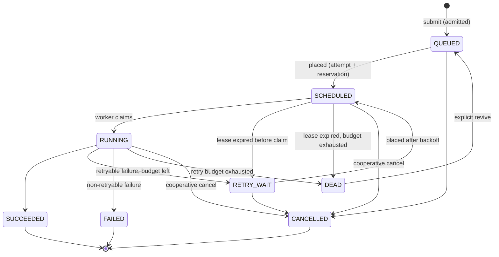

# QuantaRun specification

Derived from the owner's brief (`docs/brief/PROJECT_BRIEF.md`, plus v1 additions). This document fixes the
*semantics*. How they are built is in `ARCHITECTURE.md`, and why is in `adr/`. Keep it in sync with the code.
If behaviour and this document disagree, one of them is a bug.

## 1. Scope

QuantaRun is a local-first control plane that accepts workloads from projects (tenants), places them on
heterogeneous workers using a pluggable scheduling policy, and runs them with leases, retries and
checkpoints. It explains every placement decision and can replay the same workload through a
deterministic simulator to compare policies.

Out of scope: running arbitrary code or containers, real GPU isolation, multi-region operation,
preemption and gang scheduling (roadmap only).

## 2. Domain vocabulary

| Term | Meaning |
|---|---|
| **Project** | A tenant. Owns API keys, jobs, a fair-share weight and quotas. |
| **Job** | One logical workload submitted by a project. It has at most one *active attempt* at a time. |
| **Workload type** | A built-in, registered executor (`delay`, `cpu-hash`, `memory`, `http`, `mock-inference`, `fail`, `staged`). Clients choose a type and send a bounded JSON payload. They never send code. |
| **Requirements** | CPU (millicores), memory (MiB), accelerator slots, and required worker labels. |
| **Worker** | A separate process that registers capacity (CPU, memory, accelerators, execution slots, labels, version), heartbeats and executes attempts. |
| **Attempt** | One execution try of a job on one worker. It is also the *assignment*: it holds the resource reservation and the lease. Attempts are never overwritten; a retry creates attempt N+1. |
| **Lease** | The attempt's `lease_expires_at`. The worker extends it while alive; expiry means the worker is presumed lost. |
| **Scheduling decision** | A structured record explaining one placement evaluation: policy, chosen worker, candidates, and the verdict and reason for each. |
| **Checkpoint** | A committed stage result of a *staged* workload. A later attempt resumes after the last committed stage. |

## 3. Job lifecycle

| From | To | Trigger |
|---|---|---|
| QUEUED | SCHEDULED | scheduler reserves resources on a worker and creates an attempt |
| QUEUED | CANCELLED | cancel request |
| SCHEDULED | RUNNING | the worker claims its assignment |
| SCHEDULED | RETRY_WAIT / DEAD | the lease expires before the claim (attempt `LOST`, failure `WORKER_LOST`) |
| SCHEDULED, RUNNING | CANCELLED | a cancel was requested and the worker acknowledged it, or the lease expired |
| RUNNING | SUCCEEDED | the worker reports success for the *active* attempt |
| RUNNING | RETRY_WAIT | a retryable failure and attempts remain (`available_at = now + backoff`) |
| RUNNING | FAILED | a non-retryable failure class |
| RUNNING | DEAD | a retryable failure but the attempt budget is exhausted |
| RETRY_WAIT | SCHEDULED | scheduler placement once `available_at <= now` |
| RETRY_WAIT | CANCELLED | cancel request |
| DEAD | QUEUED | explicit revive (grants a fresh attempt budget; the old attempts stay in history) |

Terminal states: SUCCEEDED, FAILED, CANCELLED. DEAD is terminal except for an explicit revive.
There is no SUBMITTED state: admission is synchronous, so a job either exists as QUEUED or is rejected
with a Problem Details error. Transitions are defined in exactly one place (`JobStatus`), and every write
is conditional on the expected current status.

Cancellation of SCHEDULED/RUNNING work is cooperative. The job gets `cancel_requested_at`, and the worker
learns about it in its next heartbeat response, stops, and reports `CANCELLED`. If the worker never
answers, lease expiry finishes the cancellation. A cancelled job is never re-placed.

## 4. Attempt lifecycle

`ASSIGNED → RUNNING → SUCCEEDED | FAILED | LOST | CANCELLED`, with `ASSIGNED → LOST | CANCELLED` also
possible. An attempt is **active** while ASSIGNED or RUNNING. Only an active attempt holds a
reservation and a lease. Each attempt records its number, worker, reservation, lease history (renewals
are counted, not logged per renewal), start and end times, failure class, retry decision and trace ID.

## 5. Worker lifecycle and health

Stored lifecycle: `ACTIVE`, `DRAINING`, `OFFLINE`, `DEREGISTERED`. Health is derived from the heartbeat age,
using configurable thresholds:

| Health | Condition (defaults) | Scheduler behaviour |
|---|---|---|
| HEALTHY | last heartbeat < 6 s ago (2 missed at a 3 s interval) | eligible |
| LATE | 6–15 s | not eligible for *new* placements; leases are still honoured |
| OFFLINE | > 15 s, or leases expired | lifecycle set to OFFLINE by the reaper |

One missed heartbeat therefore never changes anything. A DRAINING worker keeps its running attempts
but receives no new ones; it still claims attempts placed on it before the drain. A worker that heartbeats again after being marked OFFLINE must re-register:
its old attempts were already recovered and it must not resurrect them.

## 6. Resource model

Per worker: `cpu_millis`, `memory_mib`, `accelerators` (simulated slots; no real GPU needed),
`slots` (concurrent executions), plus labels. Per job: requested CPU, memory, accelerators and
required labels. Each placement uses one slot.

A job is **compatible** with a worker when the worker's labels contain the required labels and each
requested quantity is at most the worker's *capacity*. It **fits** when each request is at most the worker's
*free* amount (capacity minus reserved). Outcomes:
- no registered active worker is compatible: **unschedulable** (stays QUEUED, with a visible reason);
- compatible workers exist but none fits: **waiting for capacity** (stays QUEUED);
- otherwise the job is placed.

## 7. Scheduling policies

A policy is a pure function over a snapshot (pending jobs, worker free capacity, project usage) that
returns placements with explanations. The live scheduler and the simulator run the same code.

Each policy combines a job **ordering** with a worker **placement** strategy:

| Policy | Ordering | Placement |
|---|---|---|
| `FIFO` | `available_at`, then id | first compatible that fits (by worker id) |
| `PRIORITY` | priority desc, then FIFO | first fit |
| `LEAST_LOADED` | FIFO | the worker with the lowest dominant-resource utilization after placement |
| `FAIR_SHARE` | lowest project virtual time first (below), then FIFO within the project | least loaded |
| `DEADLINE` | earliest deadline first (EDF); no deadline sorts last; then priority | least loaded |
| `BIN_PACKING` | FIFO | best fit: the worker with the least remaining dominant resource after placement |

**Fair share: weighted virtual time.** Each project keeps a virtual time `v`. When one of its jobs is
placed, `v += cost / weight`, where `cost` is the job's dominant resource share times its estimated
duration (a default estimate when unknown). The scheduler serves the backlogged project with the
smallest `v`. When a project becomes backlogged after being idle, its `v` is raised to the smallest `v`
among active projects, so idle time cannot be banked as credit. This is start-time fair queuing
applied to projects. A project that floods the queue only raises its own `v`, so other projects keep
being served in proportion to their weights.

Strict priority can starve low priority work. That is a property of the policy, shown in simulation,
not a bug. Fair share can delay high-priority work from a heavy project. Both trade-offs are shown in
the Policy Lab.

## 8. Failure semantics

| Class | Retry? | Delay |
|---|---|---|
| TRANSIENT | yes | exponential backoff with full jitter |
| TIMEOUT | yes | backoff |
| RATE_LIMITED | yes | max(`Retry-After`, backoff) |
| PROVIDER_UNAVAILABLE | yes | backoff |
| WORKER_LOST | yes | none (re-placed immediately) |
| RESOURCE_EXHAUSTED | yes | backoff |
| INVALID_INPUT | no → FAILED | – |
| NON_RETRYABLE | no → FAILED | – |
| INTERNAL | yes | backoff |

Defaults: `max_attempts = 3` per job (overridable at submission, capped at 10); backoff
`base * 2^(attempt-1)` capped at 60 s, with full jitter. Every retry decision is stored on the attempt that
failed. Details and worked examples are in `FAILURE_SEMANTICS.md`.

## 9. Idempotency

`POST /jobs` accepts an `Idempotency-Key` header, unique per project, together with a hash of the request
body.
- Same key, same body: `200` with the existing job (the original is replayed; no new work).
- Same key, different body: `409 Conflict`.
- Concurrent duplicates: exactly one job exists. This is guaranteed by a unique constraint and
  `INSERT ... ON CONFLICT DO NOTHING`, never by check-then-insert.

Worker reports are idempotent too. Reporting the same outcome twice for the same attempt returns the
recorded outcome. A report for an attempt that is no longer active is rejected (`409`), which fences
stale workers.

## 10. Checkpoints

Only the `staged` workload type is checkpointable. Its payload declares an ordered list of stages. After
each stage, the worker commits a checkpoint (stage index plus a small JSON result, capped at 8 KiB). The commit
is accepted only while the attempt is active. A new attempt receives the last committed checkpoint and resumes
after it. The job timeline shows `resumed from stage k` versus `started from zero`.

## 11. Simulation and replay

A **scenario** generates a workload trace from a seed: arrivals, project, requirements, priority, deadline,
duration and failure injections. The discrete-event simulator replays a trace against a policy on a
simulated fleet, using simulated time only, with no sleeping and no wall clock. The same trace, seed and
policy configuration always produce identical results, and a test compares result hashes. Built-in scenarios:
`BURST`, `STEADY`, `MIXED_RESOURCES`, `ACCELERATOR_SCARCE`, `NOISY_NEIGHBOR`, `DEADLINE_HEAVY`,
`WORKER_FAILURE`, `RATE_LIMIT`.

Reported metrics:
- throughput, and queue wait (mean, p50, p95, p99);
- completion latency and deadline miss rate;
- CPU, memory and accelerator utilization;
- starvation (maximum wait), and fairness (Jain's index over the per-project normalized service);
- scheduler decision time.

## 12. API surface (v1)

These are resources, not a contract. The contract is the generated OpenAPI document.
- `/api/v1/jobs`: submit, list/filter, get, cancel, revive; plus attempts, events, decisions and checkpoints for a job.
- `/api/v1/workers`: list, get, drain (operator).
- `/worker-api/v1/...`: register, heartbeat, claim, report, checkpoint. These use worker credentials, not project keys.
- `/api/v1/projects`, `/api/v1/projects/{id}/api-keys`: admin only.
- `/api/v1/scheduler`: active policy, recent decisions, unschedulable jobs.
- `/api/v1/simulations`: run a scenario against several policies; fetch the results.
- `/api/v1/chaos`: trigger predefined, project-local fault scenarios only.
- `/api/v1/events/stream`: Server-Sent Events, resumable with `Last-Event-ID`.

All errors are `application/problem+json` with a stable `code`.

## 13. Security

- Project API keys: 256-bit random, shown once, stored as SHA-256 hashes with a lookup prefix, revocable.
- Workers authenticate with a separate worker token.
- There is no endpoint that executes a client-supplied command.
- The HTTP workload blocks private, loopback and link-local addresses after DNS resolution, with an
  optional explicit allowlist (SSRF).
- Request bodies and payloads are size-capped.
- Chaos endpoints act only on QuantaRun's own workers, and only in `chaos`-enabled profiles.

See `THREAT_MODEL.md`.

## 14. Phases and acceptance criteria

A phase is complete only when its criteria are met *and verified by running them*.

**Progress:** Phase 0 done (2026-09-30). Phase 1 done (2026-09-30): verified locally with `./mvnw verify`, `npm run check` and `docker compose up --build --wait`, probed through nginx. CI is defined but has not run yet, because there is no GitHub remote. Phase 2 done (2026-09-30): jobs API, state machine, idempotent submission, cancellation, project API keys and OpenAPI, all verified by 63 tests on real PostgreSQL. Phase 3 done (2026-10-01): worker registration with per-worker credentials, heartbeats, derived health, draining, deregistration, retirement of silent workers with a startup grace period, capacity CHECK guards, and three heterogeneous workers in compose. Verified by 96 tests and an end-to-end kill/stop/restart run. Phase 4 done (2026-10-02): attempts as assignments with reservations, the transactional scheduling cycle, FIFO/PRIORITY/LEAST_LOADED/BIN_PACKING, structured decision records with per-worker verdicts, and the background loop. Verified by 130 tests (property tests over 2,000 random cases per policy, 16 concurrent cycles per policy on real PG) and end to end on the compose stack. Phase 5 done (2026-10-02): claim, heartbeat lease renewal and fenced reports; the lease reaper, armed only after extending leases on startup; worker executors for `delay`, `cpu-hash`, `mock-inference` and `fail` with slots, timeouts, cancellation and graceful shutdown. Verified by 197 tests (160 control plane, 37 worker), including completion racing lease expiry (8 × 40 attempts against 4 concurrent reapers) and heartbeats racing the reaper on real PG 18, and end to end: a worker killed with `kill -9` mid-job was recovered and the job finished on another worker (FAILURE_SEMANTICS.md). The compose images were not built in the development environment; CI builds them.

| Phase | Acceptance criteria |
|---|---|
| 0 Research & architecture | RESEARCH, SPEC, ARCHITECTURE, INVARIANTS (planned tests), ADRs, CLAUDE.md exist and agree with each other |
| 1 Foundation | `./mvnw verify` green (incl. a Testcontainers Flyway clean-migration test); web builds, lints, typechecks and tests; `docker compose up --build` serves health endpoints and the UI shell; CI workflow defined |
| 2 Jobs & state machine | Submit/get/list/cancel API; the centralized transition table has exhaustive tests; illegal transitions fail; concurrent idempotent submission yields exactly one job; events are recorded |
| 3 Workers & resources | Register, heartbeat and drain; health derivation; capacity columns with DB CHECK guards; a worker process runs from compose |
| 4 Scheduler | FIFO, PRIORITY, LEAST_LOADED and BIN_PACKING placements with decision records; concurrent schedulers never overcommit (a property test plus a multi-thread test on real PG) |
| 5 Leases & reliability | Claim, renew and expire; the reaper recovers expired attempts and releases resources; the kill-worker demo works end to end; completion racing expiry has exactly one winner |
| 6 Retries & failures | Failure classes; backoff and jitter; the retry budget is never exceeded; DEAD and revive work; cancellation races are tested |
| 7 Fairness & advanced | FAIR_SHARE and DEADLINE; quotas and admission reasons; a flooding tenant does not starve another (test) |
| 8 Simulation | Deterministic DES; 8 scenarios; multi-policy comparison; the same seed gives a byte-identical result |
| 9 Chaos | Predefined safe faults; the recovery timeline is visible |
| 10 Observability | OTel traces across control plane and worker; Micrometer metrics; structured logs with IDs |
| 11 Frontend | All views from the brief, on real data, with loading, empty and error states; SSE with reconnect |
| 12 Concurrency hardening | The mandatory race tests pass repeatedly; results documented in INVARIANTS |
| 13 Performance | Measured benchmarks with full environment metadata; optimizations justified by before/after data |
| 14 Security | Threat model; SSRF, key hashing and payload limits are tested |
| 15 Release | README with real screenshots, DEMO, PORTFOLIO, INTERVIEW_GUIDE, FINAL_REVIEW; high and critical findings fixed |
